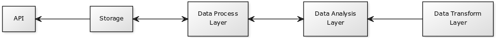

# Documentation

## [Ways of Working](docs/ways-of-working.md)

* [Definition of Done](docs/ways-of-working.md#markdown-header-definition-of-done)
* [Issue tracking](docs/ways-of-working.md#markdown-header-issue-tracking)
* [Topic branches](docs/ways-of-working.md#markdown-header-topic-branches)
* [Commit messages](docs/ways-of-working.md#markdown-header-commit-messages)
* [Code review](docs/ways-of-working.md#markdown-header-code-review)
* [Changelog](docs/ways-of-working.md#markdown-header-commit-changelog)
* [Gitflow](docs/ways-of-working.md#markdown-header-gitflow)
* [Release](docs/ways-of-working.md#markdown-header-release)
* [Principles for Evaluating Pull Requests](docs/pull-request-evaluation.md)
* [Project members](docs/project-members.md)
* [Project Description](#markdown-header-project-description)
* [3rd Party Libraries](docs/3rd-party-libs.md)

## Project Description

Online reviews have risen as one of the major factors that influence purchase behaviours of today’s consumers. Thanks to sites like Yelp and, as well as social networks like Twitter. Those reviews provide strong word-of-mouth power that can draw or drive away potential customers.

Companies now embrace reviews as part of their marketing strategy. A Search Engine Land report found as much as 83% of marketers believe managing reviews produces good ROI. Managed correctly, online reviews can also support and improve the effectiveness of your social media strategy.

The Bodacious Advisor for Cuisine Over N-joyment ranks the restaurants within London based on their online reviews on Twitter. 

## The Bacon Approach
Our journey begins with a dataset provided by Yelp, which we use to get reviews and their associated Star Evaluation, using a parser to extract this key-value pair. This new dataset is used to train algorithms that are used for sentiment analysis so that we can read tweets for restaurants and predict its Star Evaluation (*-tweet). Reviews from Yelp will only be used for training the Ranking Algorithm. 

Using a list with 2365 restaurants based in London with Tweeter account, we use Twitter-API to get tweets that mention those accounts so that we can apply our sentiment analysis algorithm on them, discovering their *-tweet. Our time window is three months from now, so we will not consider old tweets.

//toDo Machine Learning (Sara)

//toDo ranking algorithm (Sara)

//toDo weight model (Sara)

## The B.A.C.O.N Stack
To achieve a lean architecture avoiding the waste of resources, our proposed stack took into consideration the volume of the data and the requirements regarded to its availability. For now, we are dealing with Mbs to Gbs of data and providing a new rank every day. With this scenario, a real-time ranking model is not necessary. Also, the volume of the data does not require a data processing cluster. At the point that our data grows to Tbs to Pbs, we have a plan to scale our storage and provide a spark cluster to handle all the data processing, but for now, it is not the case. The B.A.C.O.N Stack is shown bellow:

* Programming Languages
    * Scala
    * GoLang
    * Python
* Storage
    * Neo4j
* Other Tools
    * Dataiku

The robustness of Scala allows us to have a solid development environment, ready to scale. At the same time, the quick development in Python and GoLang makes possible to script our code faster and adapt easier in early stages of the project. This easiness of evolute and adapt our processes very fast, is also verifiable in Dataiku and Neo4j. As a graph database, Neo4j is not only a solid ACID Db choice, is a great solution when we need to be in the constant evolution of our data model, eliminating risks of changing data structure and inserting new relationships. In Dataiku, the data science team can test a variety of algorithms, adapt them, clean and manage the data fast, and, when it will be necessary, use a remote Spark cluster to improve the resources for data processing.

## Architecture Overview
The B.A.C.O.N pipeline for ranking restaurants is built on top of 5 components: 

1. An API to enables the access the Ranked Data inside the storage through an HTTP request;
2. A Data Transform Layer (DTL) for cleaning and normalising data from Yelp Dataset and Twitter List Members;
3. A Data Process Layer (DPL), responsible for getting tweets about restaurants and formatting the data into our standard before store it;
4. The Data Analysis Layer (DAL) stands on top of DataIku, where our team of Data Scientists perform sentiment analysis/ranking algorithms and weight models to get the Restaurant Rank;
5. We also have a Storage system to keep our precious data protected.

The communication path through our components can be seen in the following image. 

The main point of access B.A.C.O.N data is through our API, which communicates directly with the storage to retrieve ranked data. The storage is also reached by the Data Process Layer, responsible for data management and communication with the Data Analysis Layer. In DAL is where the magic occurs, machine learning algorithms specialised in sentiment analysis classification identify our tweets in Good and Bad and apply our weight model to better rank the restaurants. The DTL is responsible for translating the dataset from YELP to our data structure that will be used for training the algorithms in the DAL.

Below we demonstrate the B.A.C.O.N. activity flow.
 

Starting with the Yelp Reviews Extractor, we get the **Stars** and the **Free Text Review**, this data is cleaned and loaded into DataIku where it will be used to train our sentiment analysis algorithm. At the same time, the Twitter List Members Extractor uses the Twitter API to get the list of restaurants based in London which have a Twitter Account. With this list, we can use the Twitter API to read the tweets within the last three months that mention those restaurants. This Tweets data is stored, and inside DataIku, the data scientists load this dataset. If we don't have any trained algorithm, now it is time to have it, another way, we will use our previously trained sentiment analysis algorithm to classify each tweet in **good** or **bad**. With the **good/bad** classification performed, now it is time to apply the weight model so we can produce our Ranking and store it.

Also, bellow we show the use cases in B.A.C.O.N.

The six main tasks of B.A.C.O.N consist in retrieve a list of restaurants based in London that have a Twitter account. With this list, we can search for tweets about them and use this data in a sentiment analysis algorithm. The process to get the Rank for London Restaurants is done after we apply the Weight Model over our Classified Tweets.
