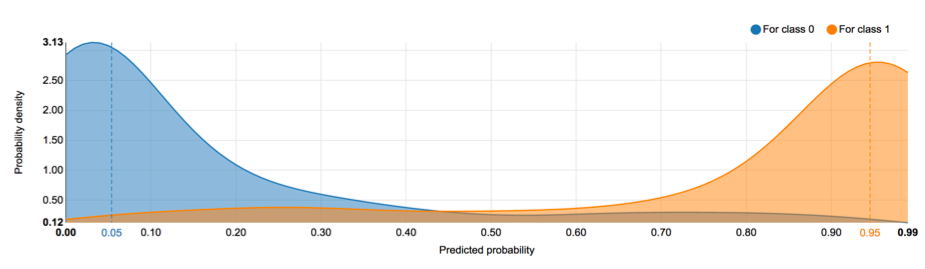

# Data Science

## 1.	Sentiment Analysis Model

Aim: Teach a machine learning to read an online review and determine whether the review is good or bad.

Reason behind methodology: Due to the nature of the YELP dataset with text reviews and correspondent Star ranking, prediction was assumed to be well fitted for purpose of classifying reviews. Binary classification was chosen in detriment of multiple classification due to the difficulty of dealing with natural language processing. In a first approach, multiple classification did not return favourable results.

Drawbacks: Multiple classification would be preferred to make the rank of the restaurants with the criteria metrics visible to users. This is because, it is easier to show the top restaurants and support its position with the criteria metrics.    

Technology used: Dataiku was used to train and test the sentiment analysis model.

Dataset: The ingested YELP dataset (see Section ) was explored and verified for type of features and for number of reviews per restaurant. Although composed by 40.000 reviews, by the time being, it included little reviews per restaurant.
The dataset consists of a set of JSON files that include review objects such as star rating, the review text, the review date, and the number of votes that the review has received. The star rating (1 to 5) was classified into either Bad/Good review. A bad review was categorised by having a score 1 or 2, whereas a good review was categorised by having a score between 3 to 5. From a first approach to the dataset it was verified that 3 was mostly associated by customers as a good review.

The features extracted for the sentiment analysis from YELP database were the classification (B/G) (target) and the correspondent review (text feature). 20000 restaurants reviews were randomly selected from the YELP dataset, where 10000 reviews were classified as B (bad) and other 10000 as G (good). The random dataset was then checked for English words.
The random dataset was imported into Dataiku.

Data preparation: Before training the sentiment analysis model, the text suffered data cleaning, as follows:
*	Removing reviews with empty values;
*	Converting text to lower case;
*	Removing punctuation;
*	Unicodeing normalization;
*	Removing stop words in English;
*	Removing non-writable characters;
*	Applying the technique of Bag of Words, i.e., tokenize the text using a process called stemming.

Split dataset: Dataset was randomly splitted to training (80%) and testing (20%) dataset.

Run binary classification algorithms: Training dataset was used to train the sentiment analysis model. The text was transformed into N-grams – 1, 2, 3n grams and it was handled using the TF/IDF (Term Frequency/Inverse Document Frequency). 4 algorithms were tested for classification with 10 K-fold cross-validation strategy:
*	XGBOOST;
*	Logistic regression;
*	SGD with logistic regression;
*	SGD with SVM.

Other algorithms were not used due to memory overruns in Dataiku.
After running the 4 algorithms these were checked for performance. ROC and F1-score values, density chart and confusion matrix were analysed.

Tuning of the models: After variables interpretation, the text feature was customized to remove custom stop words that have no meaning. This process was done until the it was achieved a good set of variables.

Test algorithms and select the best model: Testing dataset was used to test the algorithms and the best model was selected. The XGBOOST proved to be the best model with a ROC value of 0.934, a F1-score of 0.8468 and a well distributed density chart (see Figure 1). Also, the confusion matrices coming from the training and testing dataset were compared to check for overfitting. The comparison did not indicate overfitting with the model predicting well the good reviews 83% of the time and the bad reviews 87% of the time.    

Figure 1. Density chart of the XGBOOST model.

## 2.	Weight model

Aim: Score the restaurants in terms of four criteria (our criteria assumed) to rank them in a list.

Reason behind methodology: There is the need to consider other criteria, apart from the one that classifies the restaurants in terms of percentage of positive reviews, to help scoring the restaurants and ultimately to rank them.

Drawbacks: The subjectivity of selecting the criteria and its weight.

Technologies used: The weight model was created in Dataiku using recipes and data process layers written in python (python code recipes). Neo4j, also using python code recipes, supports Dataiku in terms of data gathering, organization and filtering.

Criteria selected: Each restaurant is scored in terms of four criteria. The criteria were selected aiming to score positively the restaurants that do better in terms of positive reviews and in the number of followers. Each criterion is weighted differently, being some more important than others:
1.	Percentage of positive reviews (G);
2.	Number of positive reviews;
3.	Age of the positive reviews;
4.	Number of follower of each restaurant.

Scoring method: Considering the 4 criteria a restaurant has a higher score if it has a higher percentage of positive reviews, higher number of positive reviews and number of followers and a higher number of recent positive reviews.

After each restaurant being scored in each criterion, each score is normalized in a scale of 0-100 (where 100 is the maximum score and 0 the minimum) and the total score is calculated using equation 1.

                               Eq.1

where S is the total score of the restaurant r, wi is the weight of criterion i for restaurant r, xi, is the criteria metric of restaurant r for criterion i.

Note that the weight model filters out, from the scoring/ranking analysis, the restaurants with less than 30 reviews (in this case, tweets).

Having a total score for each restaurant it is possible to rank them in descendent order.

## 3.	Test the ranking algorithm

Aim: Test the sentiment analysis and weight model with a twitter dataset.  

Technologies used: The ranking algorithm was run in Dataiku, and Neo4j supports it (see Section). Neo4J also feeds Dataiku with reviews from tweets and pushes the results of the restaurants scoring back to the Neo4J.

Dataset: Neo4j filters the Twitter dataset to include only reviews within a timeframe window of 3 months.The Twitter dataset with ca. 40.000 tweets was ingested into Dataiku from Neo4j (see Section ).

Data preparation: Before testing the ranking algorithm, the Twitter dataset is filtered to include tweets only from customers (and not from restaurant themselves). Tweets were also transformed to remove the tweet identification of the restaurants from the text. Finally, tweets are transformed and simplified using the same methodology as for the YELP dataset in Section .

Test the ranking algorithm: After data preparation, the Tweet dataset was classified using the sentimental analysis and then each restaurant was scored for ranking using the weight model.

## 4.	Automation of the ranking algorithm

Aim: Turn the running of the algorithm in Dataiku automatic.

Technology used: Dataiku

Reason behind methodology: For the purpose of the present work, Dataiku runs the algorithm in batch mode as it was verified that the ranking of the restaurants doesn’t vary significantly with time.   

Automatic batch mode: Dataiku was set to run the algorithm in a daily batch mode, pulling Tweet data from Neo4j and pushing the results of the restaurants scoring back to the Neo4J in a daily basis.

## 5.	Presenting restaurants ranking

Aim: Present the ranking of the restaurants in London on a webpage.

Data presentation: A Web services written in GO to communicate with Neo4J and present the ranking of the restaurants on a webpage (give link). A column with ranking variation of each restaurant is shown every time that ranking is updated, so that users would know how it varies in a daily basis.
